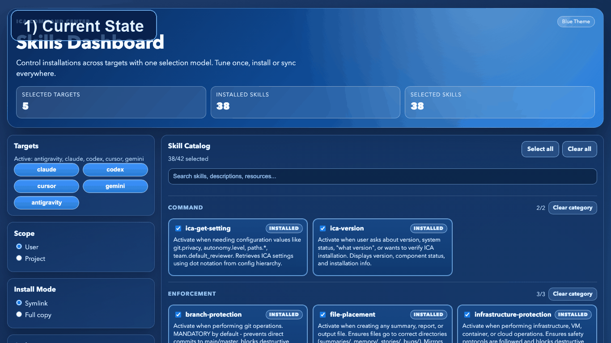
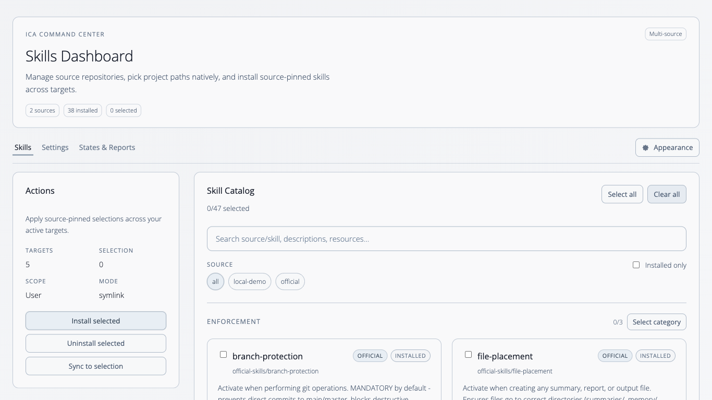
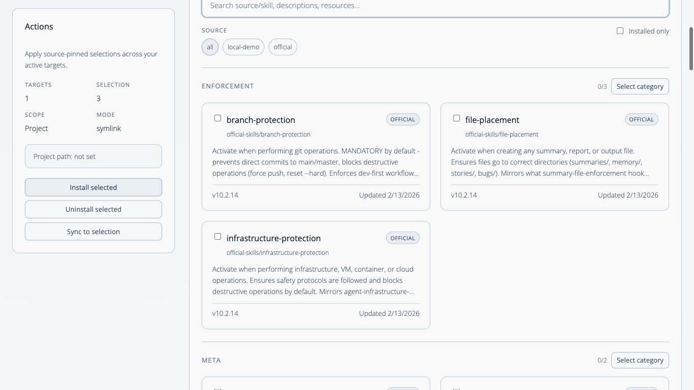
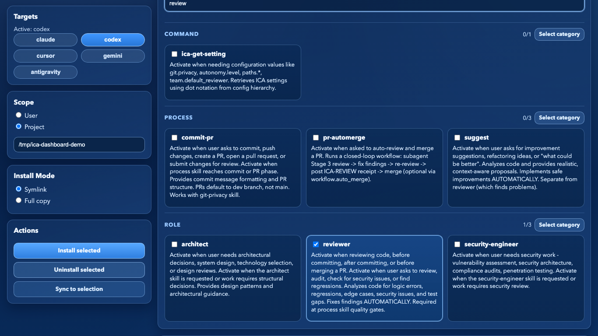
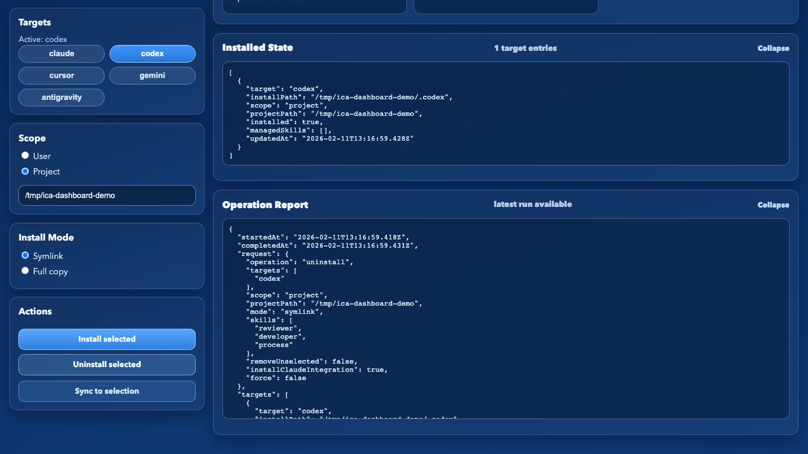

# Intelligent Code Agents (ICA)

ICA is a skills installer and manager for coding agents.

It gives you one clean control plane for:
- installing, uninstalling, syncing, and auditing skills
- managing multiple skill sources with explicit source pinning (`<source>/<skill>`)
- running from CLI or a local-first dashboard
- using verified bootstrap installers and signed, reproducible releases

## Install First (Verified Bootstrap)

Bootstrap pulls signed source artifacts from the latest release (`ica-<tag>-source.tar.gz` + `SHA256SUMS.txt`), verifies checksums, and installs `ica`.

macOS/Linux:

```bash
curl -fsSL https://raw.githubusercontent.com/intelligentcode-ai/intelligent-code-agents/main/scripts/bootstrap/install.sh | bash
```

Windows PowerShell:

```powershell
iwr https://raw.githubusercontent.com/intelligentcode-ai/intelligent-code-agents/main/scripts/bootstrap/install.ps1 -UseBasicParsing | iex
```

Then run:

```bash
ica install
ica launch --open=true
```

## Multi-Source Skills (Clear + Explicit)

ICA supports multiple skill repositories side-by-side.

- Add official and custom repos (HTTPS/SSH)
- Keep each source cached locally under `~/.ica/<source-id>/skills`
- Select skills explicitly as `<source>/<skill>` to avoid ambiguity
- Remove a source without deleting already installed skills (they are marked orphaned)
- Use the same model in CLI and dashboard

## Dashboard Preview

### Animated preview (appearance + layout)


### 1) Start with current state

Initial installed/selected overview before changing targets, scope, or skills.

### 2) Select skills and scope

`Project` scope with explicit target + skill selection (`reviewer`, `developer`, `process`).

### 3) Search/filter skills

Live filtering by keyword (`review`) while preserving selected targets/scope.

### 4) Install selected skills

Post-install evidence with expanded `Installed State` and `Operation Report`.

### 5) Manage installed skills (uninstall/sync/report)

Management action example (`Uninstall selected`) with updated state/report.

## Build From Source

```bash
npm ci
npm run build
```

## CLI Usage (`ica`)

```bash
# Install into user scope for Codex + Claude
node dist/src/installer-cli/index.js install --yes \
  --targets=codex,claude \
  --scope=user \
  --mode=symlink
```

```bash
# Project scope, selected skills only
node dist/src/installer-cli/index.js install --yes \
  --targets=codex \
  --scope=project \
  --project-path=/path/to/project \
  --mode=symlink \
  --skills=developer,architect,reviewer
```

Commands:
- `ica install`
- `ica uninstall`
- `ica sync`
- `ica list`
- `ica doctor`
- `ica catalog`
- `ica launch`
- `ica sources list`
- `ica sources add --repo-url=...` (or `--repo-path=...`; defaults to current directory when omitted)
- `ica sources remove --id=...`
- `ica sources auth --id=... --token=...`
- `ica sources refresh [--id=...]`
- `ica sources update --id=... --name=... --repo-url=...`
- `ica container mount-project --project-path=/path --confirm`

Source-qualified example:

```bash
node dist/src/installer-cli/index.js install --yes \
  --targets=codex \
  --scope=user \
  --skills=official-skills/reviewer,official-skills/developer
```

Legacy `--skills=<name>` is still accepted and resolves against the official source.

Custom repositories are persisted in `~/.ica/sources.json` (or `$ICA_STATE_HOME/sources.json` when set).

Downloaded source skills are materialized under `~/.ica/<source-id>/skills` (or `$ICA_STATE_HOME/<source-id>/skills`).
When install mode is `symlink`, ICA links installed skills from that local skills snapshot.

## Dashboard

Start locally (binds to `127.0.0.1`):

```bash
npm ci
npm run build
npm run start:dashboard
```

Open: `http://127.0.0.1:4173`

### GHCR Container

Dashboard highlights:

- Install, uninstall, and sync skills across multiple targets
- Add/remove/auth/refresh skill sources (HTTPS + SSH)
- Target discovery plus user/project scope management
- Native project directory picker (host helper) plus container mount orchestration endpoint
- Skill catalog filtering with bulk selection controls
- Installed-state and operation-report inspection in the UI

Container image can be built from `src/installer-dashboard/Dockerfile` and published to GHCR via `.github/workflows/dashboard-ghcr.yml`.

Build from source:

```bash
docker build -f src/installer-dashboard/Dockerfile -t ica-dashboard:local .
```

Run:

```bash
docker run --rm -p 4173:4173 ica-dashboard:local
```

## Supported Targets

- `claude`
- `codex`
- `cursor`
- `gemini`
- `antigravity`

## Install Modes

- `symlink` (default)
- `copy`

If symlink creation fails, ICA falls back to `copy` and records the effective mode.

## Scope Modes

- `user` scope: installs into tool home (`~/.claude`, `~/.codex`, ...)
- `project` scope: installs into `<project>/<agent-home-dir>`

CLI default for project scope: when `--scope=project` is used without `--project-path`, ICA uses the current working directory.

## Managed State

ICA tracks managed installs in:

- `<agent-home>/.ica/install-state.json`

This enables safe uninstall/sync of managed assets without deleting unmanaged user content.

## Release + Supply Chain

Tag releases from `main` (`vX.Y.Z`). The `release-sign` workflow:
- builds deterministic artifacts
- verifies reproducibility
- signs via keyless Sigstore flow
- attaches signatures/certs/checksums to GitHub release assets

## Documentation

- [Installation Guide](docs/installation-guide.md)
- [Configuration Guide](docs/configuration-guide.md)
- [Workflow Guide](docs/workflow-guide.md)
- [Release Signing](docs/release-signing.md)

## Legacy Deployment Paths Removed

Legacy deployment entrypoints were removed:
- `Makefile` deployment flow
- Ansible deployment flow
- old root `install.ps1` deployment wrapper

Use bootstrap, `ica` CLI, or dashboard going forward.
