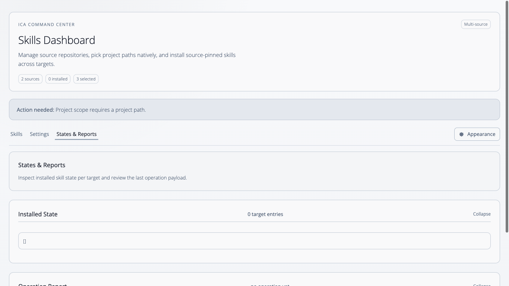

# Intelligent Code Agents (ICA)

ICA is the fastest path from "nothing installed" to a working, managed agent stack.

Use one CLI and one local dashboard to install, sync, audit, and update skills across runtimes without hand-wired setup.

What ICA gives you:
- one command surface for install/uninstall/sync/audit
- source-aware skill management with explicit pinning (`<source>/<skill>`)
- CLI + local dashboard workflows
- verified bootstrap installers and reproducible releases

## Skills Repository + Contribution

Official skills live in the standalone Skills repository:
- [intelligentcode-ai/skills](https://github.com/intelligentcode-ai/skills)

Want to add a custom skill?
- Open a PR in the Skills repo: [Create Pull Request](https://github.com/intelligentcode-ai/skills/pulls)
- Follow contribution requirements in: [How to Contribute](https://github.com/intelligentcode-ai/skills#how-to-contribute)

## Agent Bootstrap Prompt (IDE/Local Agent)

Use this when you want your local agent to do setup for you end-to-end.

Paste this into your coding agent:

```text
Bootstrap ICA for this local environment.

Your task:
1) Download and install this skill file into your own native skill storage (using your runtime's normal skill conventions):
   https://raw.githubusercontent.com/intelligentcode-ai/skills/master/skills/ica-bootstrap/SKILL.md
2) Immediately execute the installed `ica-bootstrap` skill.
3) Let `ica-bootstrap` complete end-to-end setup, including:
   - ICA CLI installation
   - skills source registration/refresh
   - installation of `ica-cli`
   - verification (`ica doctor`, `ica list`)

Behavior requirements:
- Do the work directly on this machine.
- Do not ask me where skill folders are.
- Do not ask me to confirm routine steps.
- Ask only if credentials, permissions, or security policy block execution.
- If a command fails, diagnose and retry with the safest fallback automatically.

Final output:
- What you installed
- What you executed
- Current ICA health/status
- Exact blocker only if setup is still not complete
```

Canonical prompt source:
- [skills/ica-bootstrap/assets/INITIAL_PROMPT.md](https://github.com/intelligentcode-ai/skills/blob/master/skills/ica-bootstrap/assets/INITIAL_PROMPT.md)

## Install First (Verified Bootstrap)

If you're setting up manually, this is the safest and fastest starting point.

Bootstrap downloads the latest source artifact (`ica-<tag>-source.tar.gz`), verifies it against `SHA256SUMS.txt`, and installs `ica`.

macOS/Linux:

```bash
curl -fsSL https://raw.githubusercontent.com/intelligentcode-ai/intelligent-code-agents/main/scripts/bootstrap/install.sh | bash
```

Windows PowerShell:

```powershell
iwr https://raw.githubusercontent.com/intelligentcode-ai/intelligent-code-agents/main/scripts/bootstrap/install.ps1 -UseBasicParsing | iex
```

Then run:

```bash
ica install
ica serve --open=true
```

## Multi-Source Skills (Clear + Explicit)

ICA supports multiple skill repositories side-by-side.

- Add official and custom repos (HTTPS/SSH)
- Keep each source cached locally under `~/.ica/<source-id>/skills`
- Select skills explicitly as `<source>/<skill>` to avoid ambiguity
- Remove a source without deleting already installed skills (they are marked orphaned)
- Use the same model in CLI and dashboard

## Dashboard Preview

### Animated preview (appearance + layout)


### 1) Start with current state

Initial installed/selected overview before changing targets, scope, or skills.

### 2) Select skills and scope

`Project` scope with explicit target + skill selection (`reviewer`, `developer`, `process`).

### 3) Search/filter skills

Live filtering by keyword (`review`) while preserving selected targets/scope.

### 4) Install selected skills

Post-install evidence with expanded `Installed State` and `Operation Report`.

### 5) Manage installed skills (uninstall/sync/report)

Management action example (`Uninstall selected`) with updated state/report.

### 6) Manage hooks

Dedicated hooks catalog/actions with source-aware hook install state.

## Build From Source

```bash
npm ci
npm run build
```

## CLI Usage (`ica`)

```bash
# Install into user scope for Codex + Claude
node dist/src/installer-cli/index.js install --yes \
  --targets=codex,claude \
  --scope=user \
  --mode=symlink
```

```bash
# Project scope, selected skills only
node dist/src/installer-cli/index.js install --yes \
  --targets=codex \
  --scope=project \
  --project-path=/path/to/project \
  --mode=symlink \
  --skills=developer,architect,reviewer
```

Commands:
- `ica install`
- `ica uninstall`
- `ica sync`
- `ica list`
- `ica doctor`
- `ica catalog`
- `ica serve`
- `ica launch` (alias; deprecated)
- `ica sources list`
- `ica sources add --repo-url=...` (or `--repo-path=...`; defaults to current directory when omitted)
- `ica sources remove --id=...`
- `ica sources auth --id=... --token=...`
- `ica sources refresh [--id=...]`
- `ica sources update --id=... --name=... --repo-url=...`

Source-qualified example:

```bash
node dist/src/installer-cli/index.js install --yes \
  --targets=codex \
  --scope=user \
  --skills=official-skills/reviewer,official-skills/developer
```

Legacy `--skills=<name>` is still accepted and resolves against the official source.

Custom repositories are persisted in `~/.ica/sources.json` (or `$ICA_STATE_HOME/sources.json` when set).

Downloaded source skills are materialized under `~/.ica/<source-id>/skills` (or `$ICA_STATE_HOME/<source-id>/skills`).
When install mode is `symlink`, ICA links installed skills from that local skills snapshot.

## Dashboard

Start locally (frontend container + host API control plane):

```bash
ica serve --open=true
```

Open: `http://127.0.0.1:4173`

Architecture note:
- `ica serve` runs the ICA API on localhost (`127.0.0.1`) with an ephemeral per-session API key.
- The dashboard container serves static frontend assets only.
- A host-side BFF proxies `/api/v1/*` and `/ws/events` as same-origin routes for the browser.

### GHCR Container

Dashboard highlights:

- Install, uninstall, and sync skills across multiple targets
- Add/remove/auth/refresh skill sources (HTTPS + SSH)
- Target discovery plus user/project scope management
- Native project directory picker via localhost CLI API
- Skill catalog filtering with bulk selection controls
- Installed-state and operation-report inspection in the UI
- Frontend-only container with host-BFF same-origin proxying

Container image can be built from `src/installer-dashboard/Dockerfile` and published to GHCR via `.github/workflows/dashboard-ghcr.yml`.

Build from source:

```bash
docker build -f src/installer-dashboard/Dockerfile -t ica-dashboard:local .
```

Run:

```bash
docker run --rm -p 4173:80 ica-dashboard:local
```

For full installer functionality (API + WS + container lifecycle), use `ica serve --open=true`.

## Supported Targets

- `claude`
- `codex`
- `cursor`
- `gemini`
- `antigravity`

## Install Modes

- `symlink` (default)
- `copy`

If symlink creation fails, ICA falls back to `copy` and records the effective mode.

## Scope Modes

- `user` scope: installs into tool home (`~/.claude`, `~/.codex`, ...)
- `project` scope: installs into `<project>/<agent-home-dir>`

CLI default for project scope: when `--scope=project` is used without `--project-path`, ICA uses the current working directory.

## Managed State

ICA tracks managed installs in:

- `<agent-home>/.ica/install-state.json`

This enables safe uninstall/sync of managed assets without deleting unmanaged user content.

## Release + Supply Chain

Tag releases from `main` (`vX.Y.Z`). The `release-sign` workflow:
- builds deterministic artifacts
- verifies reproducibility
- signs via keyless Sigstore flow
- attaches signatures/certs/checksums to GitHub release assets

## Documentation

- [Installation Guide](docs/installation-guide.md)
- [Configuration Guide](docs/configuration-guide.md)
- [Workflow Guide](docs/workflow-guide.md)
- [Release Signing](docs/release-signing.md)

## Legacy Deployment Paths Removed

Legacy deployment entrypoints were removed:
- `Makefile` deployment flow
- Ansible deployment flow
- old root `install.ps1` deployment wrapper

Use bootstrap, `ica` CLI, or dashboard going forward.
