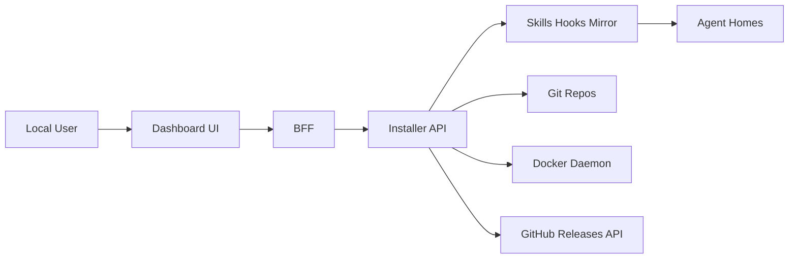

## Assumption-validation check-in
- The installer API is intended for local host use only and not internet-exposed (`/api/v1/*` loopback + API key guard).
- Skills/hooks repositories are trusted-by-default but still treated as tamperable supply-chain inputs.
- `ica serve` is run by a local developer with Docker privileges.
- The dashboard UI is accessed locally via the BFF proxy and not directly from arbitrary origins.

Questions to confirm:
1. Is any deployment expected where `/api/v1/*` is reachable beyond loopback (for example remote dev hosts or shared VMs)?
2. Are third-party/community source repos expected to be used by default in production developer environments?
3. Should symlink installs be considered acceptable for high-trust local workflows, or must copy+verify be enforced always?

## Executive summary
The highest risks are supply-chain integrity and privileged local execution paths: source sync pulls and executes content from git repositories, and dashboard/CLI orchestration performs local process and container control. Current controls are solid for local-only API access and content digest verification at install time, but residual risk remains around trust of upstream source repos and symlink-mode drift after installation.

## Scope and assumptions
In scope:
- `src/installer-cli/index.ts`
- `src/installer-api/server/index.ts`
- `src/installer-core/sourceSync.ts`
- `src/installer-core/hookSync.ts`
- `src/installer-core/executor.ts`
- `src/installer-core/hookExecutor.ts`
- `src/installer-core/updateCheck.ts`
- `src/installer-core/contentDigest.ts`
- `src/installer-dashboard/web/src/InstallerDashboard.tsx`

Out of scope:
- External GitHub/GHCR runtime security posture.
- Host OS hardening and Docker daemon configuration.

Open questions materially affecting risk:
- Whether this API is ever exposed off-loopback.
- Whether untrusted source repositories are expected in regular workflows.
- Whether symlink mode is allowed in high-assurance contexts.

## System model
### Primary components
- CLI orchestration starts API/BFF and Docker dashboard container (`src/installer-cli/index.ts:1256`).
- API provides management endpoints and enforces local-only + API key checks (`src/installer-api/server/index.ts:928`).
- Source sync pulls skills/hooks repositories and mirrors content locally (`src/installer-core/sourceSync.ts:192`, `src/installer-core/hookSync.ts:199`).
- Install executors verify content digests before/after installation in copy mode (`src/installer-core/executor.ts:86`, `src/installer-core/hookExecutor.ts:62`).
- Dashboard triggers refresh and install operations over local API/BFF (`src/installer-dashboard/web/src/InstallerDashboard.tsx:845`).

### Data flows and trust boundaries
- User UI -> BFF/API: local HTTP, API key and loopback guard.
- API -> Git remotes: git clone/fetch over HTTPS/SSH with optional credentials.
- API/CLI -> Docker daemon: container lifecycle and image pull/build operations.
- Source mirror -> Install targets: filesystem copy/symlink of skills/hooks.
- API -> GitHub Releases API: version metadata fetch (`src/installer-core/updateCheck.ts:43`).

#### Diagram

## Assets and security objectives
| Asset | Why it matters | Security objective (C/I/A) |
|---|---|---|
| Installed skills/hooks content | Controls agent behavior and command execution | I, A |
| Source credentials/tokens | Access to private repositories | C |
| API key for local control plane | Authorizes install/refresh operations | C, I |
| Local Docker/container state | Hosts dashboard process and user workloads | I, A |
| Source revision/digest metadata | Detects tampering and stale state | I |

## Attacker model
### Capabilities
- Local adversary/process on developer host attempting loopback access.
- Compromised or malicious upstream source repository content.
- Accidental operator misuse of serve/refresh workflows.

### Non-capabilities
- Remote internet attacker cannot directly call API when loopback binding is preserved.
- Browser-origin attacker cannot call API without local origin and API key routing controls.

## Entry points and attack surfaces
| Surface | How reached | Trust boundary | Notes | Evidence (repo path / symbol) |
|---|---|---|---|---|
| `/api/v1/*` endpoints | Local HTTP requests | UI/process -> API | Loopback + `x-ica-api-key` gate | `src/installer-api/server/index.ts:928` |
| Source refresh endpoints | API POST | API -> Git remotes | Triggers git sync and local mirror writes | `src/installer-api/server/index.ts:861` |
| Scheduled auto-refresh | API interval timer | API scheduler -> Git remotes | Repeated network + filesystem sync | `src/installer-api/server/index.ts:1192` |
| CLI serve container/process control | Local CLI run | CLI -> Docker/OS processes | Removes named dashboard container and reclaims ports | `src/installer-cli/index.ts:1263` |
| Install execution | CLI/API install calls | Mirror -> Agent home FS | Digest verification controls integrity in copy mode | `src/installer-core/executor.ts:86` |

## Top abuse paths
1. Attacker compromises configured source repo -> API refresh pulls malicious skill -> operator installs -> agent executes attacker instructions.
2. Local process obtains API key from local environment/log leak -> issues install/uninstall API calls -> modifies agent home behavior.
3. Malicious local process binds dashboard internal port -> prevents serve startup or induces operational failure.
4. Operator enables symlink mode -> source directory changes post-install -> runtime content drift bypasses post-copy verification.
5. Upstream API (GitHub releases) manipulation/instability -> update notification noise or suppression -> delayed patch adoption.

## Threat model table
| Threat ID | Threat source | Prerequisites | Threat action | Impact | Impacted assets | Existing controls (evidence) | Gaps | Recommended mitigations | Detection ideas | Likelihood | Impact severity | Priority |
|---|---|---|---|---|---|---|---|---|---|---|---|---|
| TM-001 | Compromised source repository | Source repo configured/enabled and refreshed | Serve/API refresh pulls malicious skills/hooks | Agent behavior compromise, possible command execution | Installed skills/hooks, agent homes | Digest verification on install (`src/installer-core/executor.ts:86`, `src/installer-core/hookExecutor.ts:62`) | Integrity assures consistency, not trust provenance | Add signed manifests/commit pinning and allowlist trusted source owners | Alert on source revision jumps and digest deltas | medium | high | high |
| TM-002 | Local unauthorized caller | API key disclosed or guessed; local host access | Call `/api/v1/*` mutating endpoints | Unauthorized install/remove/sync | API key, install state | Loopback restriction + API key check (`src/installer-api/server/index.ts:937`) | No rate limiting/audit policy for failed auth attempts | Add auth-failure throttling and structured security logs | Track repeated 401/403 bursts | low | high | medium |
| TM-003 | Local availability attacker | Port contention on UI/API/internal dashboard ports | Block or disrupt serve orchestration | Installer downtime, failed refresh/install sessions | Docker state, API/BFF availability | Named-container removal + targeted reclaim (`src/installer-cli/index.ts:426`) | Loopback reclaim can still terminate non-ICA PIDs for API/UI ports | Restrict PID reclaim to ICA-owned commands, otherwise fail-fast | Log process commandline before kill; emit warning if non-ICA | medium | medium | medium |
| TM-004 | Credential persistence leak | HTTPS token used for source sync; abnormal interruption | Tokenized remote URL left in local git config | Secret exposure from local state | Source credentials | Remote URL reset logic in `finally` (`src/installer-core/sourceSync.ts:244`) | Crash/kill -9 before cleanup can leave credentialized URL | Prefer per-command auth helper over storing tokenized remote URL | Periodic scan for credentials in `~/.ica/**/.git/config` | low | high | medium |
| TM-005 | Update-check path abuse | External API slowness/outage | Health/update check stalls or fails | Operational noise, delayed UX | Update telemetry | Timeout + cache in update checker (`src/installer-core/updateCheck.ts:41`, `src/installer-core/updateCheck.ts:69`) | No signed metadata verification, relies on API response trust | Optionally verify release origin metadata and add backoff metrics | Monitor update-check errors and latency | low | low | low |

## Criticality calibration
- critical: direct remote code execution or cross-tenant data compromise without local preconditions.
- high: local-to-privileged compromise of agent behavior or credential theft with realistic prerequisites.
- medium: meaningful availability or integrity degradation requiring local foothold/misconfiguration.
- low: telemetry/noise issues or edge-case misbehavior with limited security impact.

## Focus paths for security review
| Path | Why it matters | Related Threat IDs |
|---|---|---|
| `src/installer-core/sourceSync.ts` | Source trust boundary and tokenized remote handling | TM-001, TM-004 |
| `src/installer-core/hookSync.ts` | Hook source sync executes same trust pattern as skills | TM-001, TM-004 |
| `src/installer-core/executor.ts` | Skill integrity enforcement and install mode semantics | TM-001, TM-003 |
| `src/installer-core/hookExecutor.ts` | Hook integrity enforcement and install mode semantics | TM-001, TM-003 |
| `src/installer-api/server/index.ts` | Local authn/authz guard and scheduled refresh surface | TM-002, TM-005 |
| `src/installer-cli/index.ts` | Docker/process lifecycle controls and potential local DoS | TM-003 |
| `src/installer-core/updateCheck.ts` | External metadata trust and timeout/cache strategy | TM-005 |

## Quality check
- Entry points covered: API routes, refresh endpoints, serve orchestration, install paths.
- Trust boundaries represented in threats: UI/API, API/Git, API/Docker, mirror/target FS, API/external release API.
- Runtime vs CI/dev separation: runtime installer paths only; CI workflows treated as out of scope.
- User clarifications: pending (questions listed in assumption check-in).
- Assumptions/open questions: explicitly documented above.
